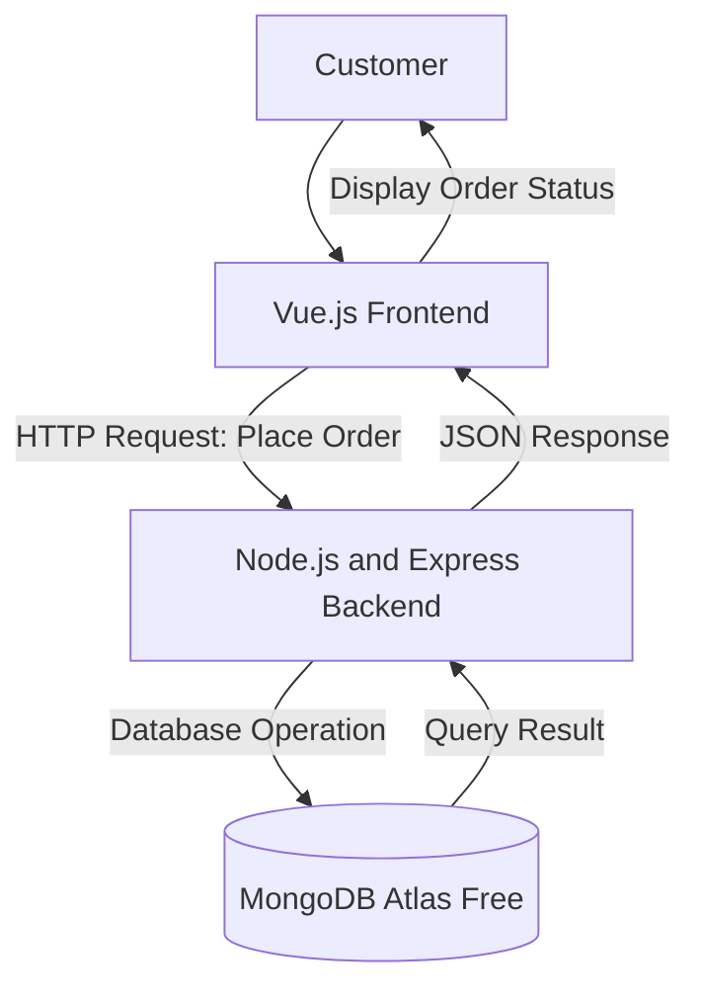

# System Architectural Design

## 1. System Overview
The Food Ordering System is a web-based application that allows customers to view a restaurant's menu, place orders online, and track order status in real time, while staff manage and update those orders through a backend interface.

## 2. Selected Architectural Pattern
The proposed system will use a three-tier client-server architecture.
The system will be divided into:
1. Presentation layer
2. Application layer
3. Data layer

This architecture separates the user interface, business logic, and data management responsibilities.

## 3. Architectural Components

### Presentation Layer
The presentation layer will use Vue.js. It will display the menu, collect order details from the customer, and send order requests to the backend.

### Application Layer
The application layer will use Node.js and Express. It will receive order requests, validate order data, apply business rules (e.g. order status transitions), and communicate with the database.

### Data Layer
The data layer will use MongoDB Atlas Free. It will store, retrieve, update, and delete menu items and order records.

## 4. Component Responsibilities

| Component | Technology | Responsibility |
|---|---|---|
| User interface | Vue.js | Displays menu items and collects order input |
| Application server | Node.js and Express | Processes order requests and applies business rules |
| Database | MongoDB Atlas Free | Stores and manages menu and order records |
| Repository | GitHub | Stores documentation and tracks changes |

## 5. System Architecture Diagram



## 6. Data Flow

### Example Process: Place a New Order
1. The customer selects menu items through the Vue.js interface.
2. Vue.js checks that required fields (item, quantity, delivery info) are filled in.
3. The frontend sends an HTTP request to the Express backend.
4. The backend validates the order and processes the request.
5. The backend sends a database operation to MongoDB.
6. MongoDB stores the new order record.
7. MongoDB returns the result to the backend.
8. The backend sends a JSON response to the frontend.
9. The frontend displays an order confirmation to the customer.

## 7. Database Plan

### Proposed Database Name
```text
food_ordering_db
```

### Primary Collection
```text
orders
```

### Proposed Fields

| Field | Type | Description |
|---|---|---|
| _id | ObjectId | Unique record identifier |
| customerName | String | Name of the customer placing the order |
| items | Array | List of ordered menu items and quantities |
| totalAmount | Number | Total price of the order |
| status | String | Current order status (e.g. pending, preparing, completed, cancelled) |
| createdAt | Date | Date the order was created |
| updatedAt | Date | Date the order was last updated |

## 8. Design Justification
The three-tier architecture is appropriate for the Food Ordering System because it separates the menu-browsing interface, order-processing logic, and order data storage into independent layers. This separation improves maintainability by allowing each layer to be updated independently, improves security by keeping database access behind the application layer, simplifies testing since each layer can be tested in isolation, and supports future development such as adding payment processing or delivery tracking without redesigning the entire system.

## 9. Architectural Limitations
The current activity focuses only on the proposed architecture. Frontend code, backend code, database connection, user authentication, and deployment have not yet been implemented. These components will be developed in Module 7.